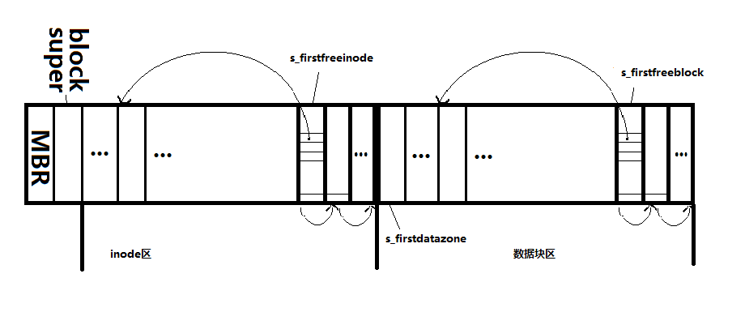

title:ext文件系统源码学习及思考
date:2014-02-18
category:filesystem

认识了linux管理文件系统的框架（也就是vfs）之后，再学习具体的文件系统就是比较容易的一件事了，下面记录了ext文件系统的学习过程，代码参考1.2.13的内核版本，这个内核版本比之现在3.x的版本可以说非常老了，但是早期版本内容注重具体实现，读起来容易很多，相信对以后继续深入学习会有很大帮助，至少现在版本的实现和早期版本的大体思想是一样的。

##本文导读：

+ ext文件系统简介及设计思想
+ ext文件系统磁盘映像X结构
+ ext文件系统的mount的过程
+ ext文件系统的io过程

****

##一 ext文件系统简介及设计思想

###ext文件系统简介
ext文件系统是第一个专门为linux内核打造的文件系统，但是现在基本已经不使用了，网上搜索原因大多是说它性能存在一些问题，我在看完源码之后也想不出任何原因，看来真是需要实践才能检验真理啊。

###ext设计思想
文件系统要完成的功能就是管理文件，而文件就是`inode`和数据块block，不同的管理方式就形成了不同的文件系统，minix文件系统使用位图来分别管理`inode`和数据块block的分配和回收。而ext文件系统使用了链表来管理它们的分配和回收。这就是ext文件系统。可以说整个ext文件系统源码就是在实现用链表组织`inode`和数据块block。

****

##二 ext文件系统磁盘映像结构

ext文件系统如图所示，第一个块是MBR块，第二个块是超级块，接下来是存放`inode`的区域，`inode`保存着文件的一些元数据，比如类型，大小，拥有者等等。再接下来是存放数据的block，数据block用来存放文件的数据。从源码中`inode`的分配和回收、数据块block的分配和回收、以及`super`块的读取等可以推出这种映像结构，以及它们链表式的管理方式。图中`inode`是按照在磁盘上的顺序编号，一个block可以放很多个`inode`，采用几个空闲的`inode`存放所有空闲`inode`的链表，当要分配一个`inode`的时候，从空闲的`inode`链表头部取出一个空闲`inode`。存放空闲`inode`链表的本身也是空闲`inode`，也就是说，`inode`在自己不被使用的时候用来管理一个`inode`链表，避免了专门非配一些存储空间来存放链表，可以看出ext设计之巧妙。随着`inode`的不断使用，链表不断减小，存放空闲`inode`链表的`inode`本身就也会被分配出去。而`inode`被释放的时候又会被重新链接到空闲链表中。数据block的管理也是这样。

****

##三 ext文件系统的的mount过程

认识一个文件系统就顺着它的生存期来看，文件系统被使用最先要挂载它，挂载就是读取它的`super_block`到内存中，ext文件系统的超级块如下：

	struct ext_super_block {
	unsigned long s_ninodes;//总inode数
	unsigned long s_nzones;//总数据block数
	unsigned long s_firstfreeblock;//第一个空闲的数据块号，这个块上面存放了空闲块的链表
	unsigned long s_freeblockscount;//总空闲数据block数
	unsigned long s_firstfreeinode;//第一个空闲的inode所在的数据块号
	unsigned long s_freeinodescount;//总空闲inode数
	unsigned long s_firstdatazone;//第一个数据block的块号
	unsigned long s_log_zone_size;
	unsigned long s_max_size;
	unsigned long s_reserved1;
	unsigned long s_reserved2;
	unsigned long s_reserved3;
	unsigned long s_reserved4;
	unsigned long s_reserved5;
	unsigned short s_magic;//Magic Number，挂载是会检查这个数字是不是约定好的一个数字，不是说明不是ext文件系统
	};

整个`mount`过程先由`vfs`中进行，先在内存中分配`super_block`，之后交由具体文件系统读取它的`super_block`。`vfs`中进行`mount`的过程，可以参考前文，`mount`系统调用调用注册到系统中的文件系统的`ext_read_super`函数，获取块设备上的超级块，填充内核中的`super_block`结构。

`ext_read_super`的主要功能是：

1 直接调用块设备层的读取函数读取块设备（这句话有点绕，我们知道，块设备的IO操作一般是通过文件系统接口的，也就是通过文件系统的读写函数完成块设备的读写，现在直接跳过文件系统层，是因为这个文件系统还没有挂载上）；

	if (!(bh = bread(dev, 1, BLOCK_SIZE))) {
		s->s_dev=0;
		unlock_super(s);
		printk("EXT-fs: unable to read superblock\n");
		return NULL;
	}

2 将读取到的块（这个块在高速缓存buffer中）中相关信息写入到内存中分配到的`super_block`数据结构中，将`firstfreeinode`和`firstfreeblock`所在的块读取到高速缓存区中，ext是通过链表来管理`inode`和block的分配和回收的，不需要用位图，这点感觉是更加智能，空间利用率提高了

	s->u.ext_sb.s_ninodes = es->s_ninodes;
	s->u.ext_sb.s_nzones = es->s_nzones;
	s->u.ext_sb.s_firstdatazone = es->s_firstdatazone;
	s->u.ext_sb.s_log_zone_size = es->s_log_zone_size;
	s->u.ext_sb.s_max_size = es->s_max_size;
	s->s_magic = es->s_magic;
	s->u.ext_sb.s_firstfreeblocknumber = es->s_firstfreeblock;
	s->u.ext_sb.s_freeblockscount = es->s_freeblockscount;
	s->u.ext_sb.s_firstfreeinodenumber = es->s_firstfreeinode;
	s->u.ext_sb.s_freeinodescount = es->s_freeinodescount;

3 将`super_operation`的指针保存在`super_block`中，这一步非常重要，后面的读取`inode`等的操作函数都在这个`super_operation`中。

	s->s_op = &ext_sops;

	static struct super_operations ext_sops = { 
		ext_read_inode,
		NULL,
		ext_write_inode,
		ext_put_inode,
		ext_put_super,
		ext_write_super,
		ext_statfs,
		NULL
	};

4调用`iget将根`indoe读入内存，并记录在`super_block`中。

	if (!(s->s_mounted = iget(s,EXT_ROOT_INO))) {
		s->s_dev=0;
		printk("EXT-fs: get root inode failed\n");
		return NULL;
	}

`iget`也是整个文件系统中非常重要的函数，它获得根`inode`的过程如下:

i 获取`inode`内存中的数据结构，如果内存中已经存在指定设备和结点号的`inode`，直接获取，如果不存在，新分配一个。

	repeat:
		for (inode = h->inode; inode ; inode = inode->i_hash_next)
			if (inode->i_dev == sb->s_dev && inode->i_ino == nr)
				goto found_it;
		if (!empty) {
			h->updating++;
			empty = get_empty_inode();
			if (!--h->updating)
				wake_up(&update_wait);
			if (empty)
				goto repeat;
			return (NULL);
	

ii 调用`read_inode`函数，`read_inode`是`vfs`范畴的函数，它调用具体的文件系统，也就是`ext`文件系统的`ext_read_inode`函数

	read_inode(inode);
	goto return_it;

iii `read_inode`函数最后会将不同类型`inode`的操作函数指针记录在`inode`内存结构中，以便后面使用。

	static void read_inode(struct inode * inode)
	{
		lock_inode(inode);
		if (inode->i_sb && inode->i_sb->s_op && inode->i_sb->s_op->read_inode)
			inode->i_sb->s_op->read_inode(inode);
		unlock_inode(inode);
	}

上面`inode->i_sb->s_op->read_inode`对应的就是`ext_read_inode`。`ext_read_inode`从块设备读取inode到高速缓存区。

	block = 2 + (inode->i_ino-1)/EXT_INODES_PER_BLOCK;
	if (!(bh=bread(inode->i_dev, block, BLOCK_SIZE)))
		panic("unable to read i-node block");
	raw_inode = ((struct ext_inode *) bh->b_data) +
		(inode->i_ino-1)%EXT_INODES_PER_BLOCK;

`ext_read_inode`还有一个非常重要的作用，把不同`inode`的`inode_operations`记录到内存`inode`中。

	if (S_ISREG(inode->i_mode))
		inode->i_op = &ext_file_inode_operations;
	else if (S_ISDIR(inode->i_mode))
		inode->i_op = &ext_dir_inode_operations;
	else if (S_ISLNK(inode->i_mode))
		inode->i_op = &ext_symlink_inode_operations;
	else if (S_ISCHR(inode->i_mode))
		inode->i_op = &chrdev_inode_operations;
	else if (S_ISBLK(inode->i_mode))
		inode->i_op = &blkdev_inode_operations;
	else if (S_ISFIFO(inode->i_mode))
		init_fifo(inode);

****

##四 ext文件系统的IO过程

代码示例为1.2.13中，未参照2.x或3.x中的源码，限于水平，但是核心原理是一样的，相信不久的一天，会补充上2.x和3.x中的代码解读。

文件系统的读写最底层的功能：

+ 非配一个新inode
+ 释放一个inode
+ 非配数据block
+ 释放数据block
+ 读inode
+ 写inode
+ 读数据block 
+ 写数据block

fs/ext/Freelists.c这个文件实现了上面四个，也就是inode和block的分配和回收底层函数，文件内容大致如下：

`void ext_free_block(struct super_block * sb, int block)` 

释放block，将block回收到s_firstfreeblock指向的空闲链表中

`int ext_new_block(struct super_block * sb)` 

分配block，从s_firstfreeblock指向的空闲链表分配一个block

`unsigned long ext_count_free_blocks(struct super_block *sb)` 

统计空闲的block

`void ext_free_inode(struct inode * inode)` 

释放inode，将inode回收到s_firstfreeinodeblock指向的空闲链表中

`struct inode * ext_new_inode(const struct inode * dir)`

`unsigned long ext_count_free_inodes(struct super_block *sb)`

fs/ext/inode.c实现了较为上上层的函数，读写inode，读写super_block，文件逻辑块号到磁盘全局块号映射

`void ext_put_inode(struct inode *inode)`

 释放inode，并将文件truncate，也就是讲数据块也都同时释放。

`void ext_put_super(struct super_block *sb)`

`struct super_block *ext_read_super(struct super_block *s,void *data, int silent)`

读入super_block，上文提到，在mount时使用。

`void ext_write_super (struct super_block *sb)`

写入super_block

`void ext_statfs (struct super_block *sb, struct statfs *buf)`

显示一些文件系统的基本情况，输出到用户空间，`buf`指向用户控件的地址

`#define inode_bmap(inode,nr) ((inode)->u.ext_i.i_data[(nr)])` 

将inode中的直接的数据块号映射成磁盘中的全局的块号

`static int block_bmap(struct buffer_head * bh, int nr)`

将inode的间接数据块号映射成全局的块号

`int ext_bmap(struct inode * inode,int block)`

映射inode的数据块，调用上面两个函数完成，每个inode可以连接很多歌数据块，存储东西，普通文件的数据块中存放普通文件的数据，设备文件的数据块中存放的设备号，目录文件的数据区存放的是目录项，从这里可以看出，目录文件盒普通文件基本一致，只不过存放了特定格式的东西，而且读写目录文件不能像读写普通文件那样，要专门的接口函数才行。

`static struct buffer_head * inode_getblk(struct inode * inode, int nr, int create)`

在高速缓存区中需找直接块的高速缓存，没有的话找出一个空闲的高速缓存用于存放从发块设备上读来的数据

`static struct buffer_head * block_getblk(struct inode * inode,
	struct buffer_head * bh, int nr, int create)`

在高速缓存区中需找间接块的高速缓存，没有的话找出一个空闲的高速缓存用于存放从发块设备上读来的数据

`struct buffer_head * ext_getblk(struct inode * inode, int block, int create)`

从高速缓存中找到指定inode的逻辑块的buffer，若没有找到则分配一个高速缓存用于从块设备中读取。调用上面两个函数实现

`struct buffer_head * ext_bread(struct inode * inode, int block, int create)`

读取指定inode的逻辑块，首先在高速缓存区中找，如找到且是uptodate的，直接返回，若没有，怎调用底层块设备读取函数`ll_rw_block(READ,1,&bh);`从外部块设备读取。

文件系统已经有了bread和getblk函数了，为什么ext文件系统还要单独在实现一遍，实际上，ext_read_inode是使用bread来读取inode的块的，而ext_bread是用来读inode上的数据块的，也就是inode的数据区inode->u.ext_i.i_data的块的，两者读的块不一样。ext_getblk是调用通用的getblk来实现的，而ext_bread是调用ext_getblk和底层的ll_rw_block实现的。

`void ext_read_inode(struct inode * inode)`

从块设备上读取inode，并根据inode的类型把相应类型的inode_operations的指针写入到`inode->i_op`

`static struct buffer_head * ext_update_inode(struct inode * inode)`

把内存中的inode写入到buffer_head指向的文件系统高速缓存区指向的相应块中，buffer的调度分配函数会在适当时候将它回写到块设备中。

`void ext_write_inode(struct inode * inode)`

和上面基本一样，只是这个函数强制马上进行回写。

这个文件定义了***真正***进行 读或写数据到 具体的块设备，最重要的就是ext_read_inode和ext_getblk，读块，并将并将高速缓存中的inode写入内存中的inode

/fs/buffer.c更是真正的读或写数据到块设备，区别，读块，对块的内容不管

fs/ext/namei.c

这个文件实现了与文件系统*系统调用*有关的函数，这个文件建立在inode.c文件的上层。也就是各种inode_operation要调用的函数，下表中ext文件系统相关的操作都基本在这个文件中实现。

<table border="1">
<tr>
	<td></td><td></td><td>系统调用</td><td>ext文件系统实现</td>
</tr>
<tr>
	<td>目录文件   d</td>
	<td>
		<table>
			<tr><td>创建</td></tr>
			<tr><td>删除</td></tr>
		</table>
	</td>
	<td>
		<table>
			<tr><td>sys_mkdir</td></tr>
			<tr><td>sys_rmdir</td></tr>
		</table>
	</td>
	<td>
		<table>
			<tr><td>ext_mkdir</td></tr>
			<tr><td>ext_rmdir</td></tr>
		</table>
	</td>
</tr>

<tr>
	<td>普通文件   -</td>
	<td>
		<table>
			<tr><td>创建</td></tr>
			<tr><td>删除</td></tr>
		</table>
	</td>
	<td>
		<table>
			<tr><td>sys_open---open_namei---dir->i_op->creat</td></tr>
			<tr><td>sys_unlink---dir->i_op->unlink</td></tr>
		</table>
	</td>
	<td>
		<table>
			<tr><td>ext_creat</td></tr>
			<tr><td>ext_unlink</td></tr>
		</table>
	</td>
</tr>

<tr>
	<td>设备文件 b c</td>
	<td>
		<table>
			<tr><td>创建</td></tr>
			<tr><td>删除</td></tr>
		</table>
	</td>
	<td>
		<table>
			<tr><td>sys_mknod---dir->i_op->mknod</td></tr>
			<tr><td>sys_unlink</td></tr>
		</table>
	</td>
	<td>
		<table>
			<tr><td>ext_mknod</td></tr>
			<tr><td>ext_unlink</td></tr>
		</table>
	</td>
</tr>

<tr>
	<td>硬链接文件 -</td>
	<td>
		<table>
			<tr><td>创建</td></tr>
			<tr><td>删除</td></tr>
		</table>
	</td>
	<td>
		<table>
			<tr><td>sys_link---dir->i_op->link</td></tr>
			<tr><td>sys_unlink</td></tr>
		</table>
	</td>
	<td>
		<table>
			<tr><td>ext_link</td></tr>
			<tr><td>ext_unlink</td></tr>
		</table>
	</td>
</tr>

<tr>
	<td>软链接文件 l</td>
	<td>
		<table>
			<tr><td>创建</td></tr>
			<tr><td>删除</td></tr>
		</table>
	</td>
	<td>
		<table>
			<tr><td>sys_symlink---dir->i_op->symlink</td></tr>
			<tr><td>sys_unlink</td></tr>
		</table>
	</td>
	<td>
		<table>
			<tr><td>ext_symlink</td></tr>
			<tr><td>ext_unlink</td></tr>
		</table>
	</td>
</tr>

<tr>
	<td>未命名管道 -</td><td></td><td></td><td>与实际文件系统无关</td>
</tr>
<tr>
	<td>socket文件 -</td><td></td><td></td><td>与具体文件系统无关</td>
</tr>

</table>

